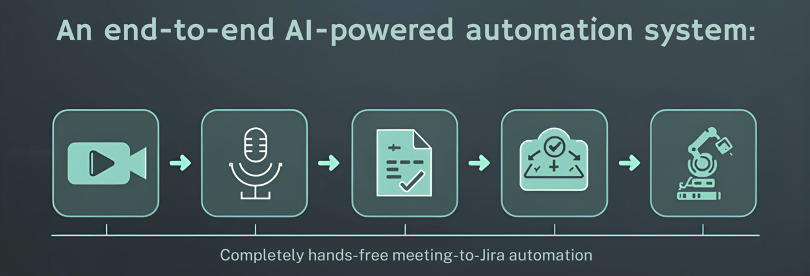

<p align="center">
  
</p>

# 🚀 AI Meeting → Jira Automation System

An end-to-end AI-powered system that converts meeting recordings into structured summaries and actionable Jira tickets using LLMs.

This project demonstrates:
- Real-world AI orchestration
- Backend + Worker architecture
- LLM-based summarization
- Human-in-the-loop Jira automation
- Scalable design for production use

---

## 🧠 Key Features

- 🎥 Supports meeting recordings (YouTube / Zoom / Google Meet recordings)
- 🧾 Automatic transcript generation
- 🤖 AI-powered summary + action item extraction
- ✅ Manual selection of action items
- 🎫 Jira ticket creation via API
- 📊 Job history tracking
- 🔄 Async background processing
- 🧩 Modular & extensible design

---

## 🏗️ High-Level Architecture
```
Frontend (Streamlit)
        ↓
FastAPI Backend
        ↓
AWS SQS (Async Queue)
        ↓
Worker Service
        ├── Audio Extraction
        ├── Whisper Transcription
        ├── LLM Processing
        └── Jira Integration
```


## 📁 Project Structure
```bash
ai-meeting-notes-jira-automation/
│
├── backend/
│ ├── app/
│ │ ├── main.py
│ │ ├── routes.py
│ │ ├── models.py
│ │ ├── db.py
│ │ ├── sqs_client.py
│ │ └── zoom_auth.py
│ │
│ ├── worker/
│ │ ├── processor.py
│ │ ├── transcript/
│ │ ├── llm/
│ │ └── jira/
│
├── frontend/
│ └── app.py
│
├── requirements.txt
├── README.md
```

## ⚙️ Tech Stack

| Layer | Tech |
|------|------|
| Frontend | Streamlit |
| Backend | FastAPI |
| Queue | AWS SQS |
| AI | OpenAI / Whisper |
| DB | SQLite |
| Infra | uv, Python |
| Integration | Jira API |
| Auth | OAuth (Zoom/Google) |

---

## 🚀 How to Run (Quick Start)

### 1️⃣ Clone Repository
```bash
git clone <repo-url>
cd ai-meeting-notes-jira-automation
```

2️⃣ Setup Python Environment (Using UV)
```bash
pip install uv
uv venv
source .venv/bin/activate   # Windows: .venv\Scripts\activate
uv pip install -e .
```
3️⃣ Start Backend
```bash
cd backend
uvicorn app.main:app --reload
```

Backend runs on:
```bash
http://localhost:8000
```

4️⃣ Start Worker (Separate Terminal)
```bash
cd backend
python -m worker.worker
```

5️⃣ Start Frontend
```bash
cd frontend
streamlit run app.py
```

UI runs on:
```bash
http://localhost:8501
```

## 🎥 Demo Flow
1. Paste meeting recording link
2. Select source (YouTube / Zoom / Google Meet)
3. Process meeting
4. View summary + action items
5. Select items
6. Create Jira tickets
7. View job history

## 🧠 Notes
* Zoom OAuth is required for private recordings
* Demo uses YouTube/Drive recordings
* Jira creation is manual (human-in-loop)
* System is production-ready and extensible

## 📌 Future Enhancements
* Zoom OAuth integration
* Google Meet auto-import
* File upload support
* Role-based access
* AWS deployment
* Caching & retries

## 👨‍💻 Author
- Built by Santosh Itkare
- AI Engineer | Backend Developer | Cloud Enthusiast